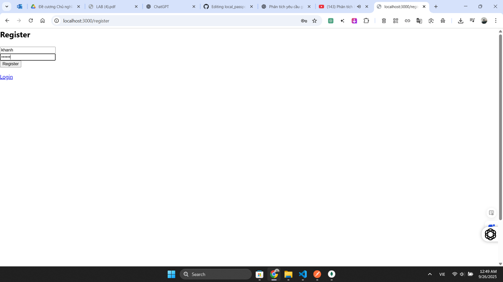

# Local Passport Website

Dự án này minh họa cách xác thực người dùng bằng **Passport Local Strategy** với giao diện website.
Người dùng có thể đăng ký, đăng nhập, xem trang cá nhân (profile) và đăng xuất.
Session được lưu qua cookie trong MongoDB.

---

## 1. Cài đặt

Cài đặt các thư viện cần thiết:

```bash
npm install
```

---

## 2. Chạy chương trình

Chạy file chính:

```bash
node app.js
```

Server mặc định chạy tại: http://localhost:3000

---

## 3. Test chức năng trên website

### 3.1. Đăng ký (Register)

* **URL**: http://localhost:3000/register
* Nhập username và password → Submit.
* **Kết quả mong đợi**:

  * Thông báo: `Register successful, you can login now`
  * MongoDB collection `users` có thêm user mới



---

### 3.2. Đăng nhập (Login)

* **URL**: http://localhost:3000/login
* Nhập username và password → Submit.
* **Kết quả mong đợi**:

  * Nếu đúng: chuyển đến `/profile`
  * Nếu sai: hiện thông báo lỗi `Wrong password` hoặc `User not found`


---

### 3.3. Trang cá nhân (Profile)

* **URL**: http://localhost:3000/profile
* **Yêu cầu**: đã login, cookie còn hợp lệ
* **Kết quả mong đợi**:

  * Hiển thị: `Welcome, <username>!`


---

### 3.4. Đăng xuất (Logout)

* **URL**: http://localhost:3000/logout

* **Kết quả mong đợi**:
  * Trở về trang `/login`
  * Cookie bị xóa khỏi trình duyệt


---

## 4. Cấu trúc thư mục

```
local_passport_website/
│── app.js
│── package.json
│── package-lock.json
│── README.md
│── config/
│   └── passport.js
│── models/
│   └── User.js
│── routes/
│   └── auth.js
│── views/
│   ├── layout.ejs
│   ├── register.ejs
│   ├── login.ejs
│   └── profile.ejs
│── public/
│   ├── style.css
│   └── results/ (ảnh minh họa test)
```

---

## 5. Ghi chú

* **Register**: tạo user mới trong database
* **Login**: xác thực user, tạo session và cookie
* **Profile**: chỉ truy cập được khi session hợp lệ
* **Logout**: xóa session và cookie, quay lại trang login

---

